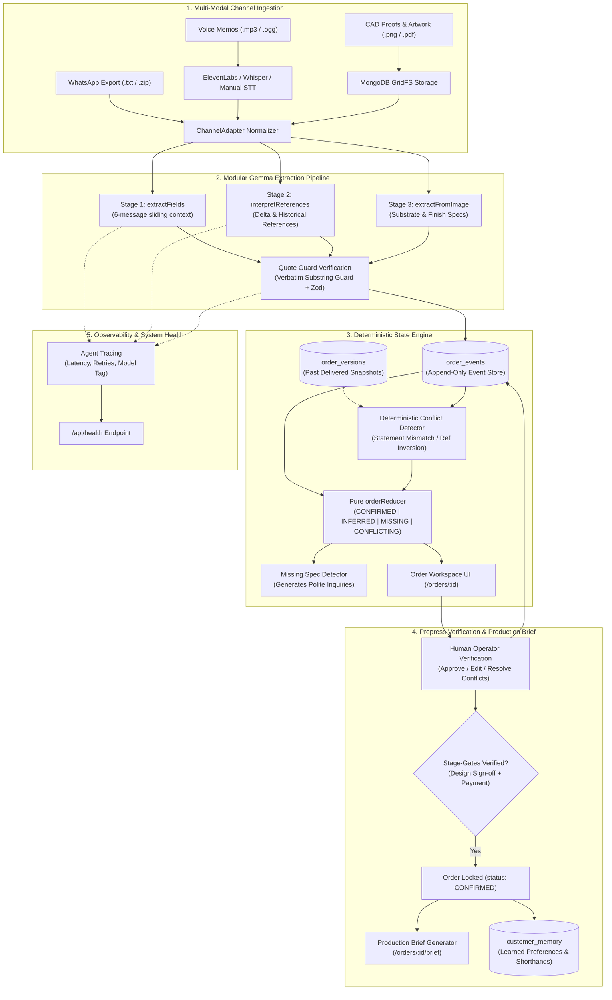

# OrderMind — Precision Packaging Intelligence from Unstructured Customer Chats

[](https://nextjs.org/)
[](https://www.typescriptlang.org/)
[-orange)](https://ai.google.dev/gemma)
[](https://tailwindcss.com/)
[](https://www.mongodb.com/)
[](https://vitest.dev/)

> **OrderMind** bridges the costly disconnect between commercial sales communication (WhatsApp threads, raw voice memos, and mockup sketches) and precision manufacturing execution for packaging converters and box manufacturers.

---

## The Problem: Why We Built OrderMind

Packaging manufacturing is an unforgiving custom-manufacturing industry with razor-thin margins and massive financial risk:
1. **Unstructured Communication Chaos**: B2B packaging clients don't submit structured ERP orders. They communicate via fragmented WhatsApp chats, audio messages on the go (*"make it 20mm taller and use the same gold foil as last month"*), and rough photos of competitor boxes.
2. **The "Game of Telephone"**: Customer service reps manually summarize chats into emails for estimators. Estimators pass notes to prepress CAD technicians. Subtle change requests (*"actually change 100 to 500 pcs"*, or *"same GSM as the festival run"*) are missed, resulting in ₹1,00,000+ substrate waste on the offset press.
3. **The AI Hallucination Trap**: Typical LLM chat wrappers hallucinate technical specs (inventing paper grammages or dieline folds that do not exist) and directly mutate database records without an audit trail.

### The OrderMind Solution

OrderMind introduces a **deterministic state machine driven by open-source Gemma AI**:
- **The LLM Never Mutates Order State Directly**: The AI model acts exclusively as an information extraction observer that produces typed, immutable `ExtractedEvent` claims.
- **Strict Verbatim Quote Verification**: Every single claim extracted by Gemma must match an exact substring in the customer's actual message. If a quote cannot be verified verbatim against the raw text, it is summarily rejected as a hallucination.
- **Deterministic Pure Reducer**: An immutable event-sourcing reducer computes real packaging fields with strict status classification: `CONFIRMED`, `INFERRED`, `MISSING`, or `CONFLICTING`.
- **Prepress & Factory Stage-Gates**: Orders cannot enter production until design sign-offs and advance payment milestones are verified server-side.

---

## Architecture & Data Flow



---

## Key Engineering Innovations

### 1. Verbatim Substring Quote Guard
LLMs are notorious for paraphrasing or fabricating details under pressure. OrderMind rejects any claim where the provided quote does not exist character-for-character within the customer's raw message:
```typescript
const quoteIndex = messageText.toLowerCase().indexOf(event.quote.toLowerCase());
if (quoteIndex === -1) {
  logger.warn(`[Gemma Guard] Rejected hallucinated quote: "${event.quote}" not in raw text.`);
  return null; // Event dropped immediately
}
```

### 2. Four Exhaustive Field Statuses
Every packaging specification (Product Type, Quantity, Dimensions, Substrate, Finish, Printing, Deadline) carries clear mathematical certainty:
- **`CONFIRMED`** (Green): Explicitly stated by the customer or signed off by an authorized operator.
- **`INFERRED`** (Amber): Relative modifications (*"+200 extra"*) or historical references (*"same as last time"*). Flags human attention before production.
- **`MISSING`** (Dashed): Required technical specification absent from the chat. Auto-drafts a polite inquiry for the customer.
- **`CONFLICTING`** (Red): Contradictory statements detected across time without an amendment cue, or draft values that conflict with historical versions.

### 3. Server-Side Stage Gates
A common source of lost revenue is printing custom boxes before receiving client design approval or the advance payment deposit. OrderMind strictly locks confirmation on the server: direct API confirmation requests bypass-tested via HTTP POST return `400 Bad Request` if mandatory gates are pending.

### 4. Company Brain & Deterministic Pricing
Pricing for custom corrugated and rigid packaging is non-linear and dependent on flute type, board caliper, and die tooling. OrderMind eliminates AI math hallucinations: prices are computed strictly through user-defined tables in Company Brain or designated as `NEEDS_QUOTE`.

---

## Tech Stack & Zero-Budget Philosophy

OrderMind is designed to run completely free of ongoing cloud subscriptions:
- **Frontend**: Next.js 15.5 (App Router, React 19, TypeScript strict), Tailwind CSS v4, Lucide Icons.
- **Backend & API**: Next.js Route Handlers, Zod schema validation, Jose JWT authentication in secure httpOnly cookies.
- **Database**: MongoDB Atlas M0 (Free Tier) or local MongoDB instance, GridFS for binary proofs.
- **AI Core**: Open-source Google Gemma 2 (9B / 27B) running locally via **Ollama** or hosted on free-tier endpoints (Groq, OpenRouter).
- **Speech-to-Text**: Multi-tiered: ElevenLabs Scribe API, local Whisper CLI, or manual transcript input.
- **Testing**: Vitest (`17 test suites / 136 tests passing`).

---

## Quickstart & Local Setup

### Prerequisites
- Node.js 18.17+ or 20+
- MongoDB instance (local or MongoDB Atlas connection string)
- *(Optional)* [Ollama](https://ollama.com/) for local Gemma 2 execution

### 1. Clone & Install
```bash
git clone https://github.com/CoderKavyaG/OrderMind.git
cd OrderMind
npm install
```

### 2. Configure Environment
Copy the example environment configuration:
```bash
cp .env.example .env.local
```

Edit `.env.local` to match your environment:
```ini
# Database Connection
MONGODB_URI=mongodb://localhost:27017/ordermind

# JWT Authentication (min 32 characters)
JWT_SECRET=super_secure_random_production_jwt_secret_min_32_chars_12345

# Application URL
NEXT_PUBLIC_APP_URL=http://localhost:3005

# Environment Mode
NODE_ENV=development

# Open-Source Gemma AI Configuration
LLM_PROVIDER=gemma
LLM_BASE_URL=http://localhost:11434
LLM_MODEL=gemma2:9b

# Speech-to-Text Engine (manual | elevenlabs | whisper)
STT_PROVIDER=manual
```

### 3. Validate Configuration
Run the automated environment diagnostic to verify all required variables:
```bash
npm run check:env
```

### 4. Verify AI Connectivity
Probe your local Ollama or hosted Gemma endpoint:
```bash
npm run check:gemma
```

### 5. Launch Development Server
```bash
npm run dev
```
Open [http://localhost:3005](http://localhost:3005) in your browser.

---

## Gemma AI Pipeline Transports

OrderMind natively supports two deployment transports behind a unified `LLMProvider` interface:

### Option A: Local Ollama (Zero Cost, Offline Private)
1. Install Ollama from [ollama.com](https://ollama.com).
2. Pull the Gemma 2 model:
   ```bash
   ollama pull gemma2:9b
   # Or for laptops with 8GB RAM:
   ollama pull gemma2:2b
   ```
3. Set in `.env.local`:
   ```ini
   LLM_PROVIDER=gemma
   LLM_BASE_URL=http://localhost:11434
   LLM_MODEL=gemma2:9b
   ```

### Option B: Hosted Cloud Endpoint (Render, Groq, OpenRouter)
Deploy without local GPU requirements using an OpenAI-compatible Gemma endpoint:
1. Create a free API key on [Groq Cloud](https://console.groq.com) or [OpenRouter](https://openrouter.ai).
2. Set in `.env.local` (or Render environment settings):
   ```ini
   LLM_PROVIDER=gemma
   LLM_BASE_URL=https://api.groq.com/openai/v1
   LLM_MODEL=gemma2-9b-it
   LLM_API_KEY=gsk_your_groq_api_key_here
   ```

For detailed troubleshooting and configuration flags, see [docs/GEMMA_SETUP.md](docs/GEMMA_SETUP.md).

---

## Automated Test Verification

OrderMind maintains high test coverage across business-critical modules:

```bash
# Run all unit, reducer, and integration test suites
npm test

# Run environment validator
npm run check:env

# Check TypeScript types
npx tsc --noEmit
```

### Key Test Suites (`17 suites / 136 tests`):
- `tests/order-reducer.test.ts`: Pure event-sourcing order replay and status computation.
- `tests/ai-extraction.test.ts`: Verbatim quote verification and hallucination rejection.
- `tests/phase6-conflict-clarification.test.ts`: Detection of 350 GSM vs 300 GSM historical conflicts.
- `tests/tenant-isolation.test.ts`: Multi-tenant workspace data scoping.
- `tests/phase-r1-company-brain.test.ts`: Deterministic pricing and server-side stage gate blocking.
- `tests/phase5b-phase7.test.ts`: Historical resolution of "same as last time" and production brief generation.

---

## Production Security & Deployment

OrderMind includes hardened security defaults for production deployments:
- **Authentication**: Stateless HMAC-SHA256 JWT tokens with 7-day expiry stored in `httpOnly`, `SameSite=Lax`, and `Secure` (in production) cookies.
- **CSRF & Origin Verification**: Validates origin headers on state-mutating requests (`POST`, `PUT`, `PATCH`, `DELETE`).
- **Rate Limiting**: Sliding window rate limiter guarding authentication endpoints against brute-force attacks.
- **Fail-Fast Boot Guard**: In `NODE_ENV=production`, the application refuses to start if `LLM_PROVIDER=mock`, forcing real Gemma AI execution.
- **PaaS Deployment**: Includes ready-to-use `render.yaml` for one-click deployment to Render or Fly.io.

---

## Documentation Index

- [docs/PROMISE_AUDIT.md](docs/PROMISE_AUDIT.md) — Comprehensive technical audit of all 22 system promises and UI handlers.
- [docs/ENV_CHECKLIST.md](docs/ENV_CHECKLIST.md) — Exhaustive master matrix of all environment variables and failure modes.
- [docs/GEMMA_SETUP.md](docs/GEMMA_SETUP.md) — Dual transport setup guide for Ollama and hosted Gemma endpoints.
- [docs/DATA_FLOW.md](docs/DATA_FLOW.md) — Step-by-step lifecycle of an ingested message to confirmed production brief.

---

## License

MIT License. Designed and engineered for high-reliability manufacturing operations.
