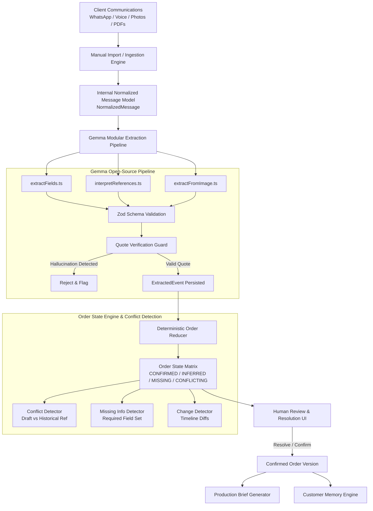

# OrderMind — Architecture & Data Flow Specification

OrderMind transforms chaotic customer communications (WhatsApp exports, audio recordings, photo dumps, PDF spec sheets) into verified, deterministic production orders for packaging manufacturers.

---

## Core Invariants

1. **LLM Never Mutates Order State Directly**: The AI model only produces immutable `ExtractedEvent` claims containing the verbatim quote and message ID.
2. **Deterministic State Computation**: The `orderReducer` computes field values and truth statuses (`CONFIRMED`, `INFERRED`, `MISSING`, `CONFLICTING`) purely based on the historical event stream.
3. **Strict Quote Verification**: Any AI claim whose quote is not found in the original source text is rejected by `verifyQuoteInText()`.
4. **Tenant Isolation**: Every database read and write is strictly filtered by the session's verified `workspaceId`.
5. **Human In The Loop**: Any inferred value or historical reference must be confirmed or resolved by a human operator before moving to `CONFIRMED`.
